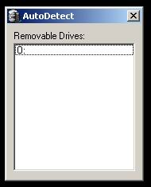



## Auto\-detect Removable Drives

### Description

This code detects removable storages using SysInfo control. Just sharing. Enjoy!!
 
### More Info
 

             |
---                |---
**Submitted On**   |2008-02-26 17:48:34
**By**             |[Uchiha Yueh](https://github.com/Planet-Source-Code/PSCIndex/blob/master/ByAuthor/uchiha-yueh.md)
**Level**          |Intermediate
**User Rating**    |5.0 (10 globes from 2 users)
**Compatibility**  |VB 5\.0, VB 6\.0
**Category**       |[Coding Standards](https://github.com/Planet-Source-Code/PSCIndex/blob/master/ByCategory/coding-standards__1-43.md)
**World**          |[Visual Basic](https://github.com/Planet-Source-Code/PSCIndex/blob/master/ByWorld/visual-basic.md)
**Archive File**   |[Auto\-detec2103692272008\.zip](https://github.com/Planet-Source-Code/uchiha-yueh-auto-detect-removable-drives__1-70159/archive/master.zip)

